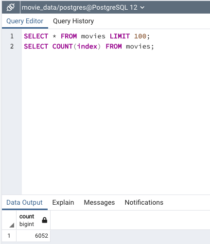
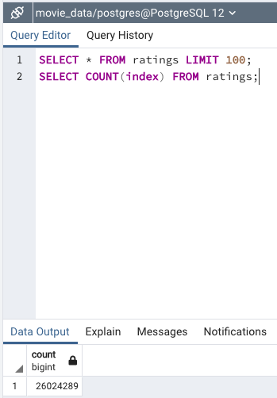

# Movies-ETL
## Extract, Transfrom, Load Movie Data
 .gif)

Source: https://gfycat.com/insistentcomplicatedarrowworm-michael-emerson-jim-caviezel

### Overview

This project aimed to gather movie data from both Wikipedia and kaggle and then create a database that we used to perform our own analysis.Also,I extracted the necessary data from Wikipedia and Kaggle, used python's pandas library to transform the data into a working dataframe, and then loaded it to PostgreSQL for a better purpose.

## Results

-After many hours of extract, transform, and load process, I had a database clean. This database contains two tables: one for movies and one for ratings. The movies table consists of 31 columns holding a range of information for 6052 different movies like the image above.

-On the other side, The rating table consists of 5 different columns holding a range of information on over 26 million individual user ratings. Finally, these clean data make it easy if someone wants to do a different analysis.
